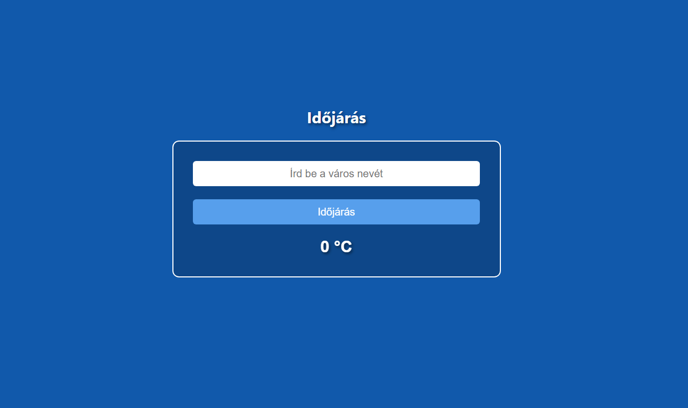

# weather-app
Egyszerű időjárás webes alkalmazás 

<i>containerben input, beviteli gomb és az adatok megjelenítésér egy div elem ami tartalmazni fog mindent alap helyzete 0 °C</i>


<i>A szerveroldalon  csatlakozunk az openweathermap api segítségével és lekérjük az adott városra vonatkozó adatokat, hibakezelés ha nem találja majd javascript segítségével a script.js-ben egyszerűen megjelenítjük </i>


```
.gitignore 

.env/
package-lock.json/
package.json/
node_modules

```

telepítéshez
```
npm init -y
npm i express
npm i cors
npm i dotenv
npm i node-fetch

```

.env file tartalma :
https://home.openweathermap.org/api_keys
```

API = A te api kulcsud 

```